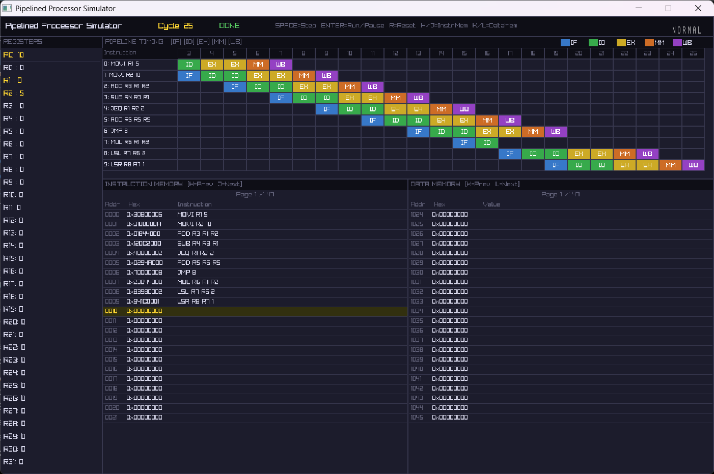

# Pipelined Processor Simulator

A C implementation of a 5-stage pipelined processor simulator for the **CSEN601 (Computer Systems Architecture)** "Package 2: Fillet-O-Neumann with moves on the side" project, with a [raylib](https://www.raylib.com/)-based GUI for visualizing instructions as they flow through the pipeline.



## Architecture

- **Von Neumann memory**: a single 2048 x 32-bit word-addressable memory shared by instructions and data.
  - Addresses `0`–`1023`: instruction segment.
  - Addresses `1024`–`2047`: data segment.
- **Registers**: 32 general-purpose registers `R0`–`R31` (`R0` is hard-wired to `0`) plus a `PC`.
- **Pipeline stages**: `IF -> ID -> EX -> MEM -> WB`. Every instruction passes through all 5 stages.
  - `ID` and `EX` each take 2 clock cycles; `IF`, `MEM`, and `WB` take 1 cycle each.
  - `IF` and `MEM` never run in parallel (they contend for the shared Von Neumann memory), so the pipeline fetches a new instruction every 2 cycles.
  - Total cycles for `n` instructions: `7 + (n - 1) * 2`.

### Instruction set

| Name | Mnemonic | Type | Format | Operation |
|---|---|---|---|---|
| Add | ADD | R | `ADD R1 R2 R3` | `R3 = R1 + R2` |
| Subtract | SUB | R | `SUB R1 R2 R3` | `R3 = R1 - R2` |
| Multiply | MUL | R | `MUL R1 R2 R3` | `R3 = R1 * R2` |
| Move Immediate | MOVI | I | `MOVI R1 IMM` | `R1 = IMM` |
| Jump if Equal | JEQ | I | `JEQ R1 R2 IMM` | `if R1==R2: PC = PC+1+IMM` |
| And | AND | R | `AND R1 R2 R3` | `R3 = R1 & R2` |
| Or Immediate | ORI | I | `ORI R1 R2 IMM` | `R1 = R2 \| IMM` |
| Jump | JMP | J | `JMP ADDRESS` | `PC = PC[31:28] \|\| ADDRESS` |
| Logical Shift Left | LSL | R | `LSL R1 R2 SHAMT` | `R1 = R2 << SHAMT` |
| Logical Shift Right | LSR | R | `LSR R1 R2 SHAMT` | `R1 = R2 >>> SHAMT` |
| Move to Register | MOVR | I | `MOVR R1 R2 IMM` | `R1 = MEM[R2 + IMM]` |
| Move to Memory | MOVM | I | `MOVM R1 R2 IMM` | `MEM[R2 + IMM] = R1` |

Immediate values are signed 18-bit two's complement, except shift amounts, which are always positive.

See `Project description/` for the full assignment specification.

## Project layout

```
include/       Public headers (structs.h, pipeline.h, parser.h, loader.h, memory.h, gui.h)
src/
  main.c       Entry point; launches the GUI on a program file
  loader.c     Reads a program file and loads encoded instructions into memory
  parser.c     Parses assembly-style instruction lines and encodes them into 32-bit words
  memory.c     Word-addressable memory model
  pipeline.c   Processor state and the IF/ID/EX/MEM/WB stage implementations
  gui.c        raylib GUI: renders the pipeline, registers, and memory, and drives simulation input
program.txt    Sample program loaded by default
```

## Building

Requires CMake 3.10+ and a C11 compiler. [raylib](https://github.com/raysan5/raylib) (v4.2.0) is fetched automatically via CMake's `FetchContent`.

```sh
cmake -B build -S .
cmake --build build
```

## Running

```sh
./build/program [path/to/program.txt]
```

If no path is given, it defaults to `program.txt` in the working directory. Each line of the program file is an assembly instruction (see the ISA table above), which is parsed, encoded, and loaded into the instruction segment of memory before simulation starts.

### GUI controls

| Key | Action |
|---|---|
| `SPACE` | Step one clock cycle |
| `ENTER` | Run / pause continuous execution |
| `R` | Reset the simulation |
| `H` / `J` | Scroll instruction memory view up / down |
| `K` / `L` | Scroll data memory view up / down |

The GUI displays which instruction occupies each pipeline stage per cycle, along with live register and memory contents.
